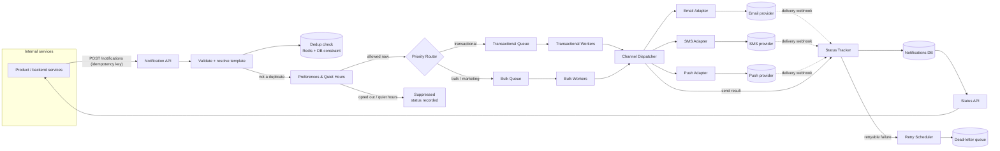

# Notification Service — System Design

## 1. Goals & scope

A service that internal systems call to send a user a notification over
email, SMS, and/or push, at roughly **10M notifications/day** (~115/s
average, with spikes — e.g. a marketing blast — an order of magnitude
higher for short bursts). It must: support multiple channels and stay
extensible to new ones; respect user preferences (opt-outs, per-channel
settings, quiet hours); avoid sending the same notification twice; track
delivery status; provide at-least-once delivery with idempotency; keep
transactional notifications near real-time while bulk traffic can be
delayed; and tolerate unreliable, rate-limited third-party providers.

## 2. Architecture



A rendered version of the same flow is in
[`architecture.png`](./architecture.png).

## 3. Data model

| Entity | Purpose | Key fields |
|---|---|---|
| `User` | Reference to the account being notified (owned by another service; referenced here by id). | `id` |
| `UserPreference` | Opt-in/out and quiet hours, per user and channel. | `user_id`, `channel`, `opted_in`, `quiet_hours_start`, `quiet_hours_end`, `timezone` |
| `Notification` | One row per logical notification event. This is where durable deduplication happens. | `id`, `idempotency_key` **(unique)**, `caller_service`, `user_id`, `type`, `priority`, `payload`, `status`, `created_at` |
| `NotificationDelivery` | One row per channel a notification fans out to (a notification can go to email and push at once). | `id`, `notification_id`, `channel`, `provider_id`, `status`, `provider_message_id`, `sent_at`, `delivered_at` |
| `DeliveryAttempt` | One row per send/retry attempt against a provider. | `id`, `delivery_id`, `attempt_number`, `result`, `error_code`, `attempted_at` |
| `Provider` | Vendor configuration per channel (supports multiple providers per channel for failover). | `id`, `channel`, `name`, `priority` |

`User 1—* UserPreference`, `User 1—* Notification`,
`Notification 1—* NotificationDelivery`,
`NotificationDelivery 1—* DeliveryAttempt`,
`NotificationDelivery *—1 Provider`.

The unique constraint on `Notification.idempotency_key` is the durable
mechanism the rest of the design relies on for deduplication — see
Section 5.

## 4. Major components

**Notification API** — entry point for internal services. Validates the
request, resolves the template, and requires an idempotency key (or
derives one from `caller_service + event_type + user_id + dedup_window`).
Returns as soon as the notification is durably recorded and queued — it
does not wait for delivery, which keeps the endpoint fast during a bulk
send.

**Preferences & Quiet-Hours** — owns per-user, per-channel settings.
Checked before queuing to avoid wasted work, and re-checked at send time
since quiet hours are time-dependent. Suppressed notifications are
recorded with a `suppressed` status rather than dropped, and
quiet-hours-suppressed bulk messages are rescheduled once the window ends.

**Priority Router + two queue classes** — transactional (password reset,
OTP, security alerts) and bulk (digests, marketing) go to physically
separate queues (e.g. separate SQS queues or Kafka topics), each with its
own worker pool:

```
Internal Services
       |
       v
Notification API
       |
       v
Priority Router
      / \
     /   \
Transactional   Bulk
Queue           Queue
  |               |
Workers         Workers
```

Separate queues and worker pools mean a large marketing campaign backing
up the bulk queue has no effect on transactional queue depth or worker
availability — they don't compete for capacity. A shared queue with a
priority field is weaker here: messages already dequeued by a worker
still occupy that worker regardless of priority, so a large batch in
flight can still delay the next transactional message.

**Channel Dispatcher & adapters** — one adapter per channel/provider
behind a common `send(notification) -> SendResult` interface, so adding
or swapping a provider (e.g. a second SMS vendor for failover) doesn't
touch routing, dedup, or status logic. Each adapter owns its own outbound
rate limiting, tuned to that vendor's documented limits, so one
provider's throttling doesn't stall sends on other channels.

**Status Tracker + Notifications DB** — every delivery's lifecycle
(`queued -> sent -> delivered/failed -> [retrying] -> final`) is
persisted. Initial `sent`/`failed` comes from the provider's synchronous
API response; `delivered`/`bounced` typically arrives later via provider
delivery webhooks, reconciled against the stored delivery by provider
message id. A relational store (e.g. Postgres) fits this well: status
transitions are few, queries are simple lookups, and webhook reconciliation
needs transactional updates.

**Retry Scheduler** — re-enqueues retryable failures with backoff, capped
at a maximum number of attempts. After that cap, the delivery moves to a
dead-letter queue instead of being silently dropped.

**Status API** — lets callers poll `GET /notifications/{id}` for current
status.

## 5. Deduplication & idempotency

At-least-once processing means duplicates can be introduced at several
points, and each needs its own safeguard — no single mechanism covers all
of them:

**Request idempotency** — the caller-supplied idempotency key is checked
in Redis first (`SETNX` with a TTL) as a fast pre-check, sub-millisecond
and off the primary database. This is a cache, not a guarantee: an
eviction, restart, or a race under load could let a duplicate past it.

**Notification deduplication** — the durable guarantee is a **unique
constraint on `Notification.idempotency_key`** in the database. The API
inserts the notification row; a constraint violation means it's a genuine
duplicate, and the existing notification's status is returned instead of
creating a new one. This is what actually prevents two logical
notifications existing for the same event, regardless of what happened in
Redis.

**Queue redelivery** — at-least-once queues can deliver the same message
twice (e.g. a worker crashes after sending but before acking). Workers
ack only after the delivery attempt is durably recorded, so a redelivered
message finds its `NotificationDelivery` row already in a terminal or
in-flight state and is treated as a no-op rather than resent blindly.

**Provider delivery** — this is the layer that cannot be fully
guaranteed. If a worker crashes after calling the provider's API but
before recording the result, the next attempt cannot know whether the
first call actually reached the provider. Where the provider supports a
client-supplied idempotency or message key (most email, SMS, and push
gateways do), we pass our own `NotificationDelivery` id as that key, so
the provider itself deduplicates on retry. Where a provider doesn't
support this, exactly-once delivery cannot be absolutely guaranteed
around a crash at that exact moment — recording the attempt immediately
before the call (not after) narrows the window, so at most a rare edge
case produces a duplicate at the last hop, rather than duplicates being
common.

## 6. Retries and failure handling

| Error class | Examples | Action |
|---|---|---|
| Retryable (transient) | 5xx response, timeout, provider 429 | Retry with exponential backoff and jitter, capped at N attempts |
| Permanent | Invalid recipient, unsubscribed, hard bounce | Fail immediately, no retry, recorded as `failed` |
| Provider outage | Circuit breaker trips after consecutive failures | Fail over to a secondary provider for that channel, where one is configured |
| Attempts exhausted | Retryable error, but the attempt cap is reached | Move to the dead-letter queue for alerting and manual review |

Not every error is retried — a permanent failure (bad recipient address,
unsubscribed number) retried on a fixed schedule just wastes provider
quota and delays the eventual `failed` status. Backoff is shorter and the
attempt cap lower for transactional traffic, so a failing OTP send is
flagged quickly rather than retried for minutes.

## 7. Scale & reliability

~10M/day is ~115/s on average, but the design has to absorb bursty spikes
(e.g. 2M notifications in a few minutes) without affecting transactional
latency. The queue separation in Section 4 is the primary lever; bulk
workers also scale independently (e.g. autoscaling on bulk-queue depth),
so a blast triggers scaling of only the bulk worker pool.

Beyond per-request idempotency keys, a secondary dedup key such as
`user_id + notification_type + short_time_bucket` catches a different
class of duplicate — e.g. two internal services both firing a "welcome"
event for the same signup, which per-request idempotency keys alone don't
catch since the two requests are genuinely different requests.

## 8. Key tradeoffs

| Decision | Chosen approach | Alternative | Why |
|---|---|---|---|
| Queueing | Separate queues per priority class | Single queue + priority field | Structural isolation guarantees transactional latency; a priority field is best-effort once a backlog exists |
| Notification store | Relational (Postgres) | Wide-column / NoSQL | Status transitions need transactional updates on webhook reconciliation; queries are simple lookups, not large scans |
| Durable dedup | DB unique constraint, Redis as a pre-check cache | Redis as the sole dedup mechanism | Redis alone can lose state on eviction/restart; the DB constraint is the source of truth |
| Delivery confirmation | Async via provider webhooks | Poll provider APIs | Webhooks are what providers support well for delivered/bounced status, and avoid polling overhead at this volume |
| Failover | Circuit breaker + secondary provider | Retry the same provider only | Time-sensitive notifications (OTP, security alerts) need delivery via *some* provider, not just the primary one eventually |

## 9. What I'd do with more time

- Per-user rate limiting on notification volume itself (distinct from
  provider-side rate limiting), so a misbehaving caller can't spam a user.
- A template/content service with versioning, so template changes don't
  require deploying the notification service.
- An audit of which providers support idempotency keys, to know exactly
  where the exactly-once gap in Section 5 actually applies in practice.
- Multi-region setup for the queueing/API tier, since "no lost
  notifications" ideally survives a regional outage, not just a process
  crash.
